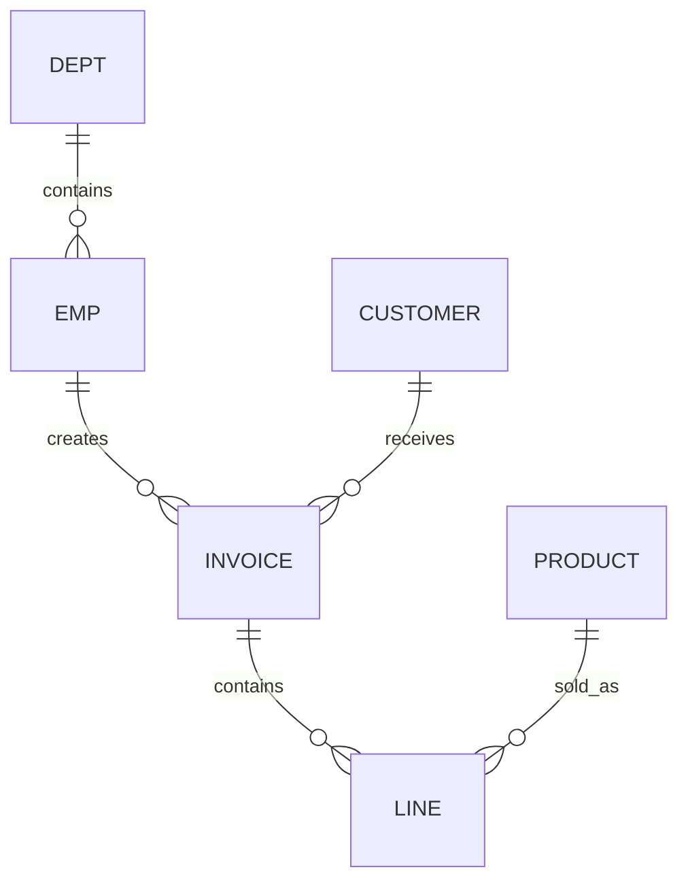
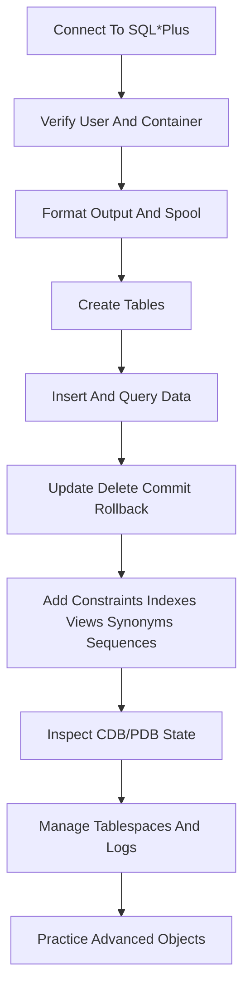
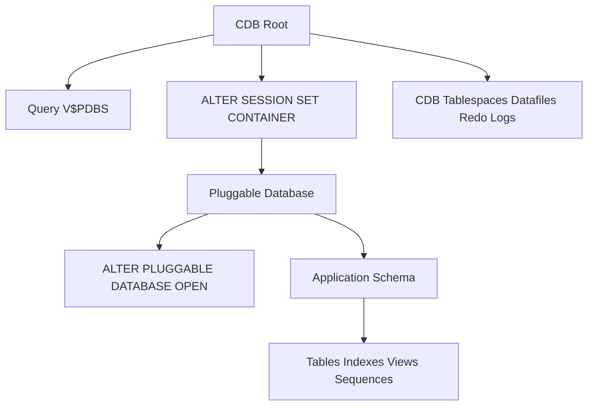
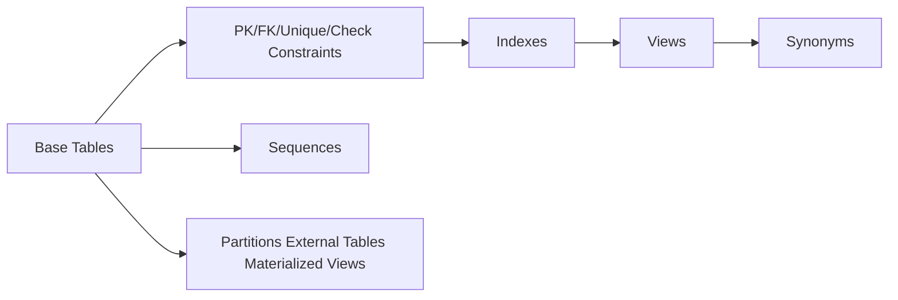

# ERD And Command Flow Diagrams

## Application ERD

```mermaid
erDiagram
    DEPT ||--o{ EMP : contains
    EMP ||--o{ INVOICE : creates
    CUSTOMER ||--o{ INVOICE : receives
    INVOICE ||--o{ LINE : contains
    PRODUCT ||--o{ LINE : sold_as
```

## SQL*Plus Learning Flow

```mermaid
flowchart TD
    A[Connect To SQL*Plus] --> B[Verify User And Container]
    B --> C[Format Output And Spool]
    C --> D[Create Tables]
    D --> E[Insert And Query Data]
    E --> F[Update Delete Commit Rollback]
    F --> G[Add Constraints Indexes Views Synonyms Sequences]
    G --> H[Inspect CDB/PDB State]
    H --> I[Manage Tablespaces And Logs]
    I --> J[Practice Advanced Objects]
```

## Oracle Multitenant Context Flow

```mermaid
flowchart TD
    Root[CDB Root] --> PDBStatus[Query V$PDBS]
    Root --> SetContainer[ALTER SESSION SET CONTAINER]
    SetContainer --> PDB[Pluggable Database]
    PDB --> OpenPDB[ALTER PLUGGABLE DATABASE OPEN]
    PDB --> Schema[Application Schema]
    Schema --> Objects[Tables Indexes Views Sequences]
    Root --> Storage[CDB Tablespaces Datafiles Redo Logs]
```

## Object Evolution

```mermaid
flowchart LR
    Tables[Base Tables] --> Constraints[PK/FK/Unique/Check Constraints]
    Constraints --> Indexes[Indexes]
    Indexes --> Views[Views]
    Views --> Synonyms[Synonyms]
    Tables --> Sequences[Sequences]
    Tables --> Advanced[Partitions External Tables Materialized Views]
```
